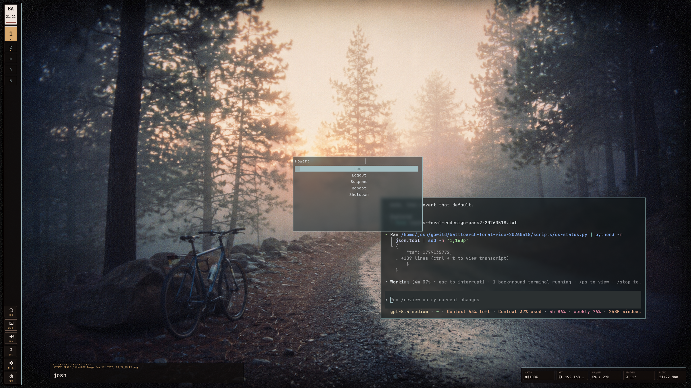
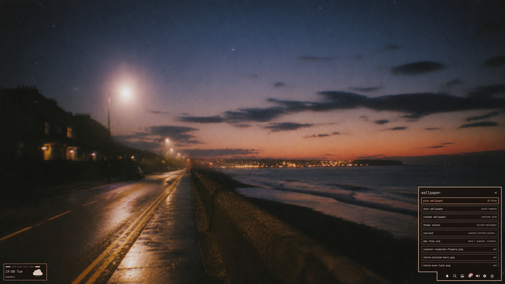
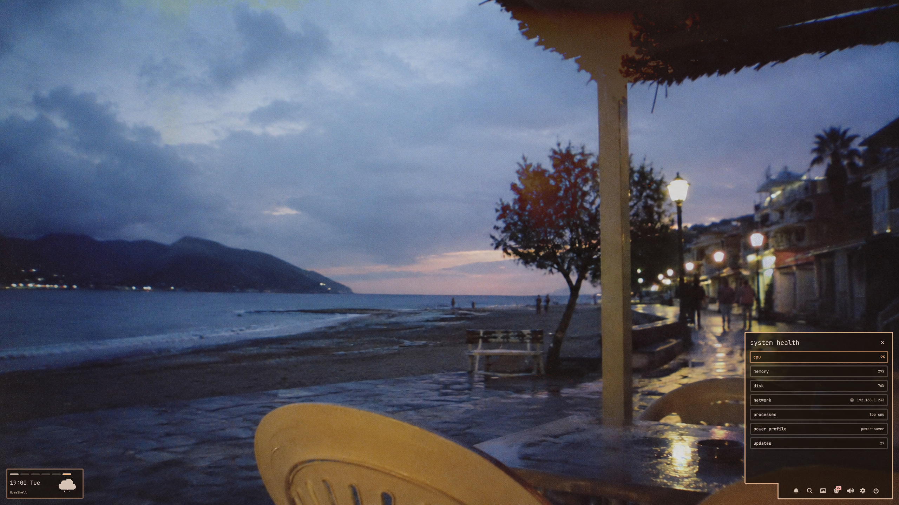
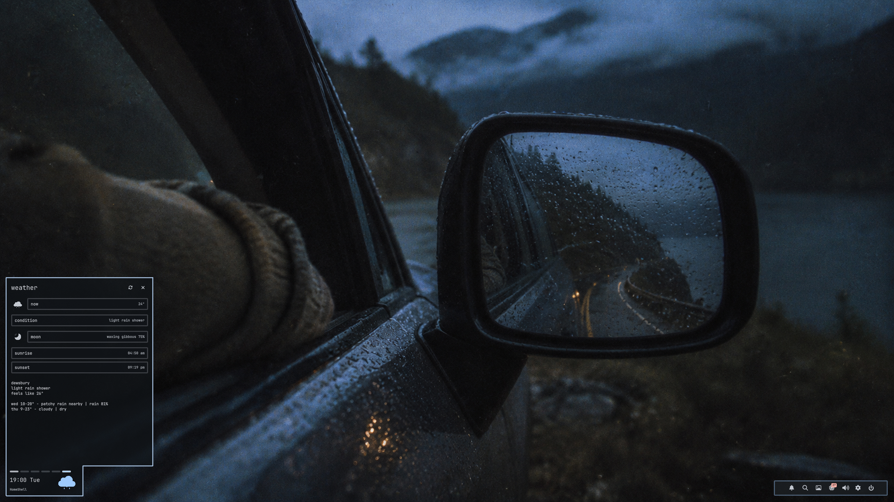
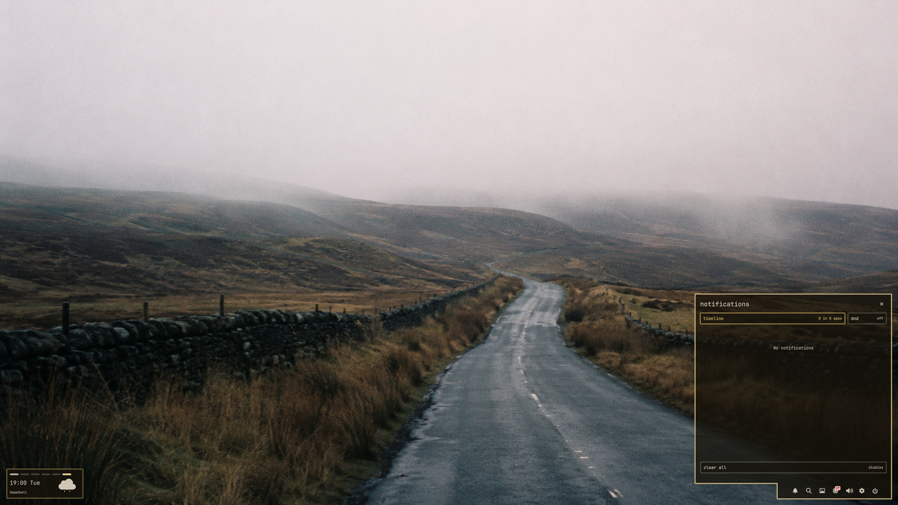

# HomeShell

A Quickshell desktop layer for Hyprland: ambient bottom-corner bars, drawer surfaces, wallpaper-derived color, workspace overview, notifications, and system controls.



## Screenshots









## Features

- Quickshell bars for workspace, clock, weather, launch, wallpaper, audio, system, notifications, and power controls.
- Hot-corner behavior: bars can sit behind windows and raise when the matching bottom corner is hovered.
- Drawer surfaces for wallpaper/theme controls, audio, network, processes, clipboard, screenshots, notifications, workspace overview, and power.
- Wallpaper-driven palette generation through `matugen`, with generated Hyprland, Waybar, SwayNC, GTK, Rofi, and Hyprlock/Pixie color files.
- Safe live-apply flow with a snapshot and revert path for existing Hyprland/Quickshell config.

## Requirements

Core:

- Hyprland
- Quickshell
- Python 3
- `jq`
- `awww`
- `grim`

Optional:

- `matugen` for wallpaper palettes
- `rofi` for pickers
- `inotify-tools` for automatic wallpaper theme watching
- `slurp` for region screenshots
- `cliphist` and `wl-copy` for clipboard integration
- `pavucontrol`, `pactl`, `playerctl`, `nmcli`, `powerprofilesctl`

## Quick Start

```bash
git clone git@github.com:cantcodetbh/homeshell.git ~/gowild/homeshell
cd ~/gowild/homeshell
./scripts/check
./scripts/launch
```

Stop the shell:

```bash
./scripts/stop
```

Try a wallpaper theme:

```bash
./scripts/wallpaper pick
```

The wallpaper picker reads from `~/Pictures/wallpapers`. This repo includes the curated wallpaper set used in the screenshots under `wallpapers/`; copy or symlink those into `~/Pictures/wallpapers` if you want the same palette rotation.

## Live Install

Run this only after `./scripts/check` and a manual launch look correct:

```bash
./scripts/apply-live
```

This snapshots the current live config before making changes. Revert with:

```bash
./scripts/revert-live
```

## Structure

```text
quickshell/homeshell/   Quickshell shell and reusable QML components
scripts/                     launch, status, wallpaper, theme, apply, revert
theme/                       default/generated theme outputs
assets/meteocons/            licensed weather icon source assets
hyprland/                    optional Hyprland integration snippet
screenshots/                 curated project screenshots
```

## Notes

This is a personal desktop rice, not a distro-neutral shell. It is designed to be readable, hackable, and safe to test without depending on another rice or dotfile distribution.

## Third-Party Assets

Weather SVGs under `assets/meteocons/` are Meteocons by Bas Milius, used under the included MIT license. The project code and configuration are otherwise self-contained.
